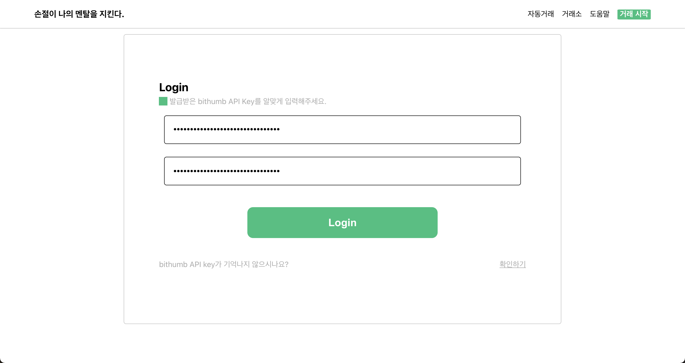
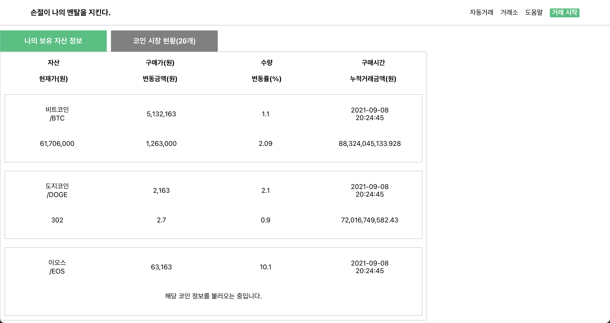
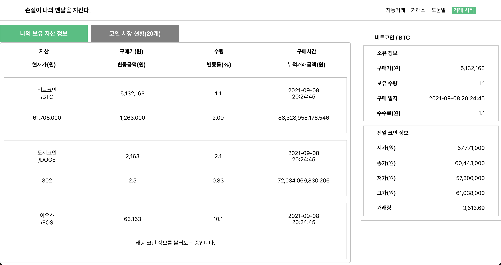
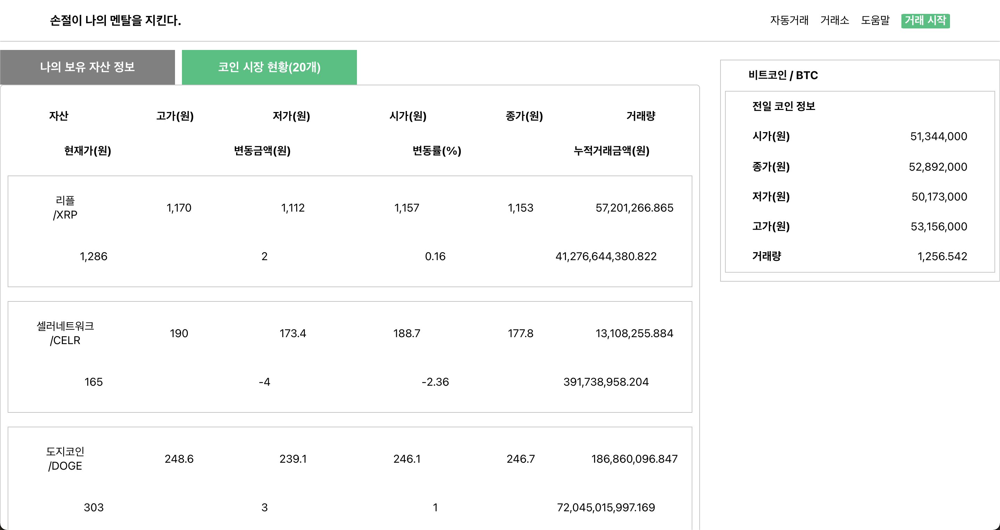
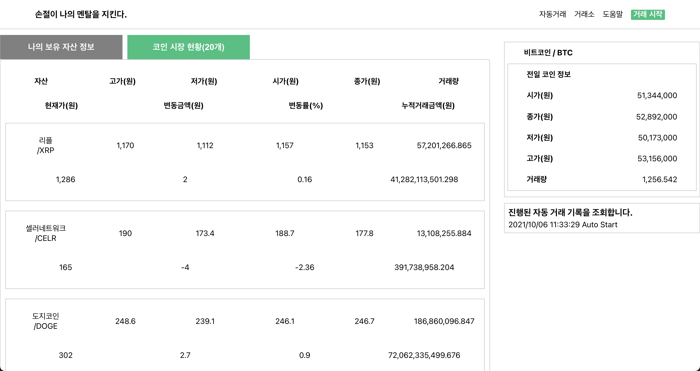

# Introduction

#### 2021 제 4회 KB국민은행 소프트웨어 경진대회
<http://www.kbsccoding.com/>

#### 코인자동프로그램 
<https://github.com/jiminAn/Coin_Auto_Trading>

 

# Role

|     팀원     |                       역할                        |          책임                        |
| :---------: | :----------------------------------------------: | :---------------------------------: |
|     [daehoon12(강대훈)](https://github.com/daehoon12)  |     PM &#128081;, 백엔드 개발   | 코인자동매매 구현 및 REST API 아키텍처 개발 |
|  [jiminAn(안지민)](https://github.com/jiminAn)   | 백엔드 개발 | DB 구축 및 REST API 아키텍처 개발   |
|     [201411108(김한동)](https://github.com/Rudy-009)   | 프론트엔드 개발  | UI디자인 및 프론트엔드 개발 |
|    [pmsu2007(박민수)](https://github.com/pmsu2007)  |    백엔드 개발  |  DB 모델 설계 및 구축  |
| [comeeasy(김준호)](https://github.com/comeeasy) |        백엔드 개발       |  데이터 병렬 처리  |

 

# Stack
- Backend : Flask, Python
- DataBase : FlaskSQLArchemy
- Frontend : React, Typescript
 

# Website

### **Login page**

  

 

### **Main Page**
#### 개인 자산 정보 조회

  

#### 개인 자산 정보 조회(상세 정보 확인 가능)

  

#### 코인 실시간 정보

  

#### 코인자동매매 실행

  

 

#### Practice Page

- 사용자가 선택한 글씨체 중 하나를 골라서 오른쪽 캔버스에 가이드 글씨로 표시

- 색깔, 굵기를 조절하여 직접 가이드 글씨 위에 손글씨 작성 가능

- 사용자가 작성한 손글씨 직접 다운로드 가능

 

# Website Demo Video
: 아래 사진을 클릭하면 유트브에서 기획 영상을 확인할 수 있습니다  

------------------------------------
20200810 글자 추출 코드 작성 (Ver 1.0) , 강대훈    
20200814 글자 유사도 비교 코드 작성(Ver 1.0), 안지민&이승준  
20200816 로컬이미지로 학습 데이터 셋 만들기(Ver 1.0), 안지민  
20200817 폰트별 알파벳 이미지 추출 (Ver 1.0), 강대훈  
20200818 폰트별 알파벳 이미지 추출 (Ver 1.1, 소문자 추출 추가) , 강대훈  
20200818 생성된 데이터 셋으로 훈련하기(Ver 1.0), 안지민    
20200818 생성된 모델로 테스트하기(Ver 1.0), 안지민    
20200822 생성된 모델로 테스트하기(Ver 1.1, Dataization 반환값 수정), 안지민  
20200823 과적합 진단을 위한 모델 학습과정 그래프그리기(Ver 1.0), 안지민   
20200825 정확도 문제로 인해 기존 데이터를 EMNIST 데이터로 변경, 강대훈  
20200826 mnist(숫자),emnist(알파벳) 데이터를 이용한 cnn 코드 (Ver 1.0), 안지민   
20200826 훈련된 모델을 로드하여 그림판으로 입력값을 넣어 숫자,알파벳 예측 (Ver 1.0), 안지민  
20200827 연속된 알파벳을 크롭하여 문자 하나하나 분리하는 코드(Ver 1.0), 안선정  
20200827 크롭한 문자 수만큼 모델은 로드하여 알파벳을 예측하는 코드(Ver 1.0), 안선정    
20200829 emnist(알파벳) 데이터를 이용한 cnn 코드 에포크 10->100, 성능 93->98% 증가 (Ver 1.1), 안지민    
20200902 웹사이트 최종본 완성 (Ver 1.1), 강대훈&안지민&이승준&안선정&임재영
